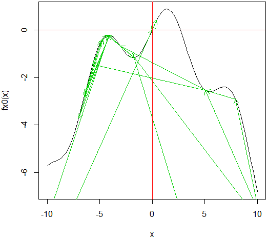
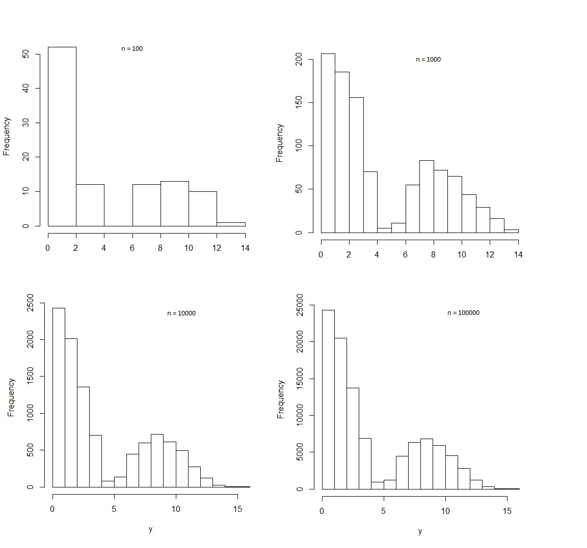

***

# História da Matemática

### O Paradoxo de Russell e sua quebra de paradigma em Teoria dos Conjuntos

Este artigo, escrito no primeiro semestre de 2020, apresenta um panorama histórico sobre a gênese da Teoria dos Conjuntos, analisando as quebras de paradigma que esta causou na matemática, assim como suas implicações na axiomatização desenvolvida posteriormente por sistemas como ZFC e Teoria das Catetegorias.

https://github.com/chicodias/20-01/raw/master/SMA0805%20LAB%20MAT/SMA0805-TRABALHO1.pdf

***

# Métodos Computacionais em Cálculo Numérico

### Soluções de Equações Polinomiais - História e Métodos Numéricos em R

Este trabalho foi realizado no segundo semestre de 2016 para a disciplina Laboratório de Matemática Aplicada, no IME-USP

Nele, apresentamos um preve panorama de como podemos calcular soluções númericas de equações polinomiais através dos Métodos de Newton e Secante, utilizando os pacotes do R *pracma* e *spuRs*.

https://github.com/chicodias/newton/raw/master/RP3%20-%20FRANCISCO%20E%20JULIA.pdf

***

### Integrais pelo Metodo de Monte Carlo

Este exercício programa, desenvolvido no primeiro semestre de 2017, foi projetado em R e teve como objetivo calcular integrais numericamente utilizando os métodos de Monte Carlo, Hit-Or-Miss, Importance Sampling, e função quadrática como variável de controle.

https://github.com/chicodias/numeric_calculus/raw/master/01-ep2.pdf

***

### Cálculo de integrais usando o algoritmo de Metropolis-Hastings

Este trabalho, desenvolvido no primeiro semestre de 2017, implementa o algoritmo de Metropolis-Hastings na linguagem R, um dos exemplos mais populares de um método de Monte Carlo via Cadeias de Markov (MCMC).

https://github.com/chicodias/numeric_calculus/raw/master/02-ep3.pdf

***

