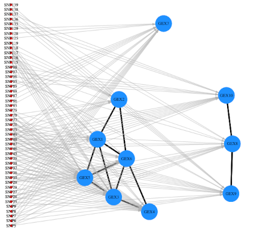

***

# Inferência Bayesiana

### Regressão Linear e Seleção de Variáveis em Alta Dimensionalidade 

Neste relatório, apresentamos brevemente algumas técnicas de caracterização molecular de alta escala, para inferir a estrutura latente de expressões gênicas de acordo com polimorfismos de nucleotídeo único (SNPs), utilizando Modelos Hierárquicos de Regressão não-relacionada aparentemente esparsa (SSUR).

https://github.com/chicodias/21-02/raw/main/SME0809-Bayesiana/MultReg_bayes/relatorio.pdf

***

# COVID-19

### Visualização dos Impactos Sociais da COVID-19

Apresentação de parte dos trabalhos desenvolvidos em 2020 pelo grupo de extensão PREDICT no 29º Simpósio Internacional de Iniciação Científica e Tecnológica da USP – SIICUSP 2021.

<iframe width="560" height="315" src="https://www.youtube.com/embed/E-VLVbHkfPY" title="YouTube video player" frameborder="0" allow="accelerometer; autoplay; clipboard-write; encrypted-media; gyroscope; picture-in-picture" allowfullscreen></iframe>

***

# História da Matemática

### O Paradoxo de Russell e sua quebra de paradigma em Teoria dos Conjuntos

Este artigo, escrito no primeiro semestre de 2020, apresenta um panorama histórico sobre a gênese da Teoria dos Conjuntos, analisando as quebras de paradigma que esta causou na matemática, assim como suas implicações na axiomatização desenvolvida posteriormente por sistemas como ZFC e Teoria das Catetegorias.

https://github.com/chicodias/20-01/raw/master/SMA0805%20LAB%20MAT/SMA0805-TRABALHO1.pdf

***

# Métodos Computacionais em Cálculo Numérico

### Soluções de Equações Polinomiais - História e Métodos Numéricos em R

Este trabalho foi realizado no segundo semestre de 2016 para a disciplina Laboratório de Matemática Aplicada, no IME-USP

Nele, apresentamos um preve panorama de como podemos calcular soluções númericas de equações polinomiais através dos Métodos de Newton e Secante, utilizando os pacotes do R *pracma* e *spuRs*.

https://github.com/chicodias/newton/raw/master/RP3%20-%20FRANCISCO%20E%20JULIA.pdf

***

