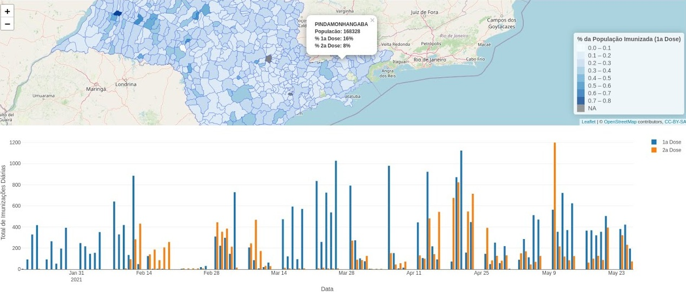

***

## Visualização de dados geolocalizados com o R-Shiny

Minicurso oferecido através do grupo de extensão PREDICT aos alunos do Bacharelado em Estatística e Ciência de Dados do ICMC-USP, e disponibilizado no Youtube.

Link do vídeo: https://youtu.be/25ND51icjIw

Material do curso: https://predict-icmc.github.io/curso-shiny/

##### Palavras-chave: `R`, `shiny`, `covid-19`, `visualização de dados`, `geolocalização`

***

## Machine Learning no Pycaret com dados do Covid-19

Minicurso de Modelos de Regressão e Séries Temporais oferecido através do grupo de extensão PREDICT e disponibilizado online.

Disponível em: https://youtu.be/nh-kSc7keJ4

Material do curso: https://predict-icmc.github.io/pycaret-covid19/

##### Palavras-chave: `python`, `machine learning`, `covid-19`, `modelos de regressão`, `séries temporais`

***

## A dispersão aleatória auxilia na sobrevivência?

Palestra sobre modelos de nascimento e morte em Processos Estocásticos, que explica como modelos com dispersão aleatória dos indivíduos podem auxiliar em sua sobrevivência.

Disponível em: <https://youtu.be/Q1_tBZmXriE>

##### Palavras-chave: `R`, `processos estocásticos`, `processos de nascimento e morte`, `modelos de dispersão aleatória`, `cadeias de Markov`

***
