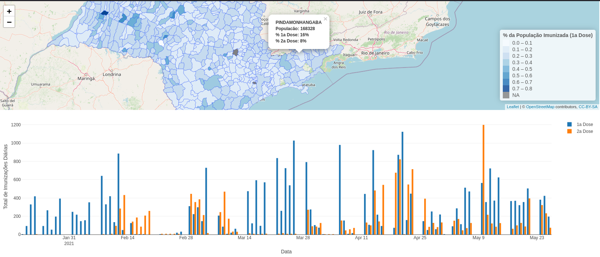
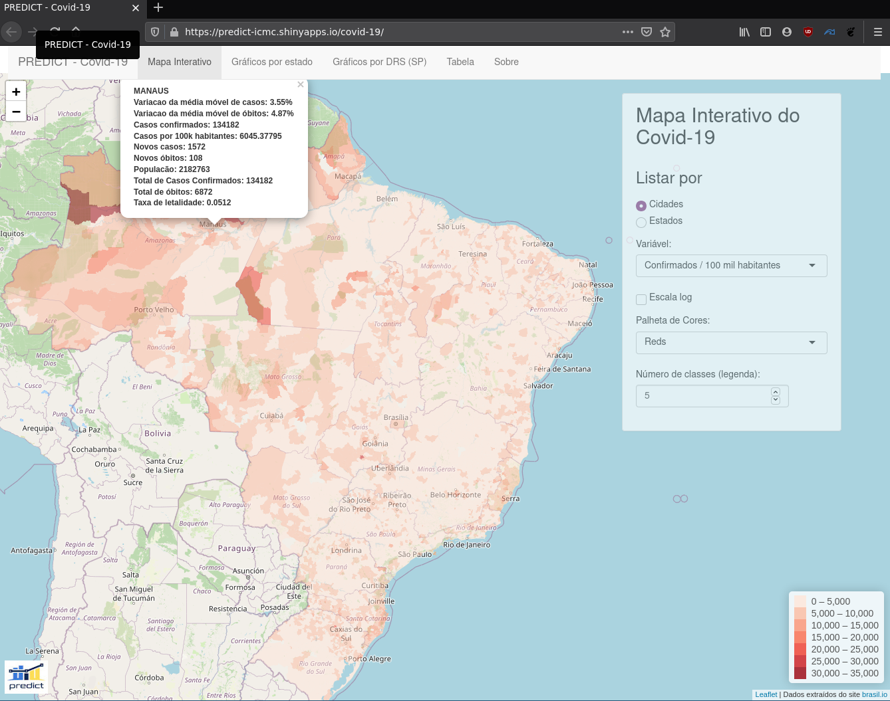

```{r include=FALSE}
#pkg loading
library(tidyverse) # ggplot2, dplyr, etc
library(MASS)
library(ggpubr) # ggbarplot e grafico de pontos
library(RColorBrewer)
library(plotly)
library(GGally)
library(minpack.lm)
library(gather.covid)
```

### Mapa da vacinação - SP

Aplicação desenvolvida durante o curso ministrado de "Introdução ao Shiny com dados geolocalizados".
Disponível em https://predict-icmc.github.io/predict-shiny/



***

### Mapa Interativo do covid-19

Aplicativo desenvolvido junto ao grupo Predict-ICMC.
Para mais informações, acesse https://predict-icmc.shinyapps.io/covid-19/


***

#### Análise exploratória do pacote *Cars93*

Nesta disciplina, utilizamos o ferramentário da Estatística Descritiva para analisar dados.

```{r message = FALSE,echo=FALSE}
dt <- Cars93 %>% as_tibble
ex1 <- dt %>% dplyr::select(EngineSize, Fuel.tank.capacity, Horsepower, Weight)

palette <- brewer.pal(6, "Set1") 
# usando as mesmas cores para o Type que nos barplots
palette <- palette[c(6,5,1,2,3,4)]
my_colors <- palette[as.numeric(dt$Type)]
ex1[,c(3,1,2,4)] %>% parcoord(col= my_colors) 
```


Gráfico de coordenadas paralelas ilustrando a distribuição das variáveis de interesse de acordo com o tipo de veículo

***


```{r message = FALSE, warning=FALSE, echo=FALSE}
palette1 <- palette[c(4,5,1,3,6,2)]
a <- dt %>% dplyr::select(EngineSize, Fuel.tank.capacity,Horsepower,Weight,Type)
a$Type <- factor(a$Type, levels =
                     c("Small", "Sporty", "Compact", "Midsize", "Van", "Large"))

b4 <- reshape2::melt(a) %>% 
  ggplot(aes(value, y = Type, color = Type)) + 
  facet_wrap(~variable, scales = "free_y") +
  geom_violin() +
  scale_color_manual(values = palette1) +
  coord_flip() +
  theme_pubr(legend = "none", x.text.angle = 90) +
  xlab(" ")
b4
```

Gráfico de violino ilustrando a distribuição das variáveis de interesse de acordo com o tipo de carro

***


```{r message = FALSE, warning=FALSE, echo=FALSE}
# Plot interativo:
fig <- dt %>%  plot_ly(x = ~Horsepower , y = ~Weight,
                        symbol = ~AirBags, size = ~Passengers,
                        color = ~DriveTrain,
                        text = ~paste(Make, '<br>Price:', Price,'K USD',
                                      '<br>Type: ', Type,
                                      '<br>Origin: ', Origin,
                                      '<br>AirBags: ', AirBags,
                                      '<br>DriveTrain: ',DriveTrain,
                                      '<br>Passengers: ',Passengers,
                                      '<br>Manual Transmission?', Man.trans.avail),
                        type = "scatter", mode = "markers")
fig
```
Plot Interativo

***