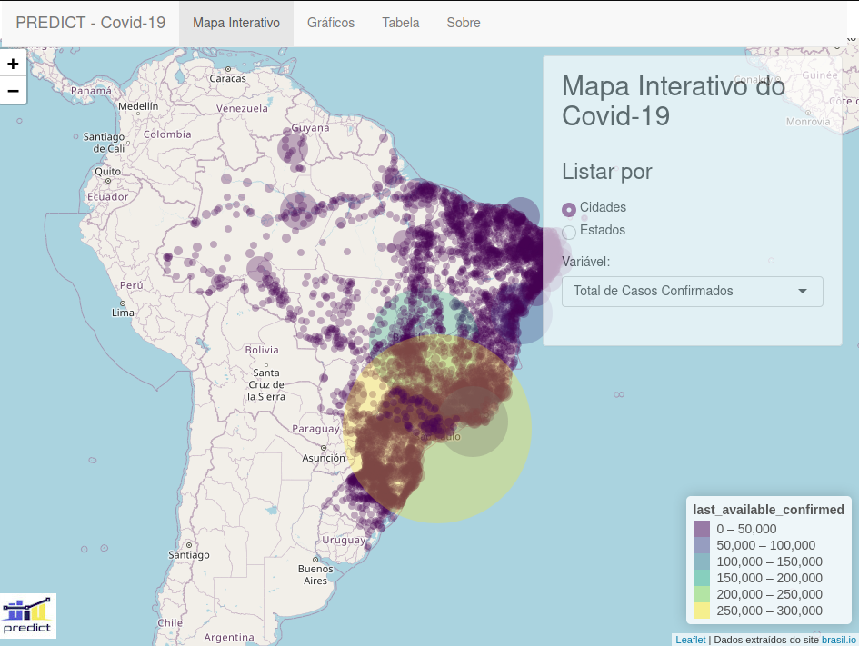
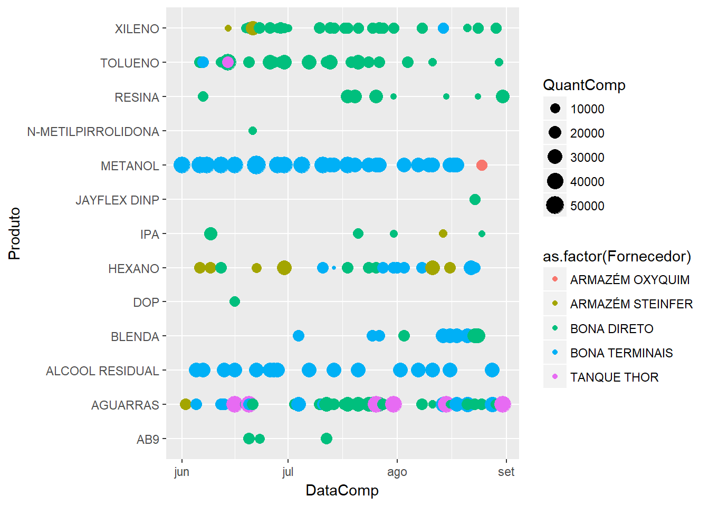

***

### https://github.com/chicodias/mac110

Exercícios-programas desenvolvidos em C no primeiro semestre de 2014 para a disciplina Introdução a Computação

***

### https://github.com/chicodias/mac122

Exercícios-programas desenvolvidos em C no primeiro semestre de 2014 para a disciplina ALgoritmos e Estruturas de Dados

***

### https://github.com/predict-icmc/covid19

Repositório de meu time com diversas ferramentas de extração, manipulação e apresentação de dados, com ênfase na pandemia do Covid-19. Aqui, tive a oportunidade de trabalhar com dados geolocalizados, modelos de regressão não lineares e ferramentas de visualização computacional.

***

### https://github.com/chicodias/chemicals

Repositório com dashboard desenvolvido para uma empresa química. 

***

### https://github.com/chicodias/20-01

Repositório com notas de classe e trabalhos realizados no primeiro semestre de 2020.

***

### https://github.com/chicodias/20-02

Repositório com notas de classe e trabalhos realizados no primeiro semestre de 2020.

*** 

### https://github.com/chicodias/newton

Repositório de cálculo numérico

*** 

