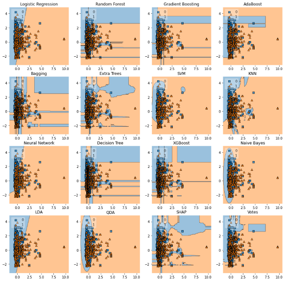

***

# Python

## Classificação

### Titanic

Notebook da competição do Kaggle que utiliza o conjunto de dados contendo informações dos passageiros do Titanic. O objetivo é classificar se determinado passageiro veio a óbito ou não, utilizando as informações fornecidas.

https://github.com/chicodias/titanicKaggle/blob/master/titanic.ipynb



***

## NLP

### Rede de personagens da trilogia O Senhor dos Anéis


Neste trabalho, geramos um dashboard de visualização interativa para as relações entre os personagens utilizando o modelo de Reconhecimento de Entidade Mencionada (NER).

[](https://github.com/chicodias/character-network)


***

## R

### Dashboard interativo do COVID-19


Aplicação web em R shiny desenvolvida no âmbito do grupo de extensão PREDICT. Aqui, tive a oportunidade de trabalhar com dados geolocalizados, modelos de regressão em séries temporais e ferramentas de visualização computacional.


[](https://github.com/predict-icmc/covid-shiny)

***

### Prevendo o sucesso de filmes com Regressão Linear Multivariada

Trabalho de conclusão do curso de Modelos de Regressão Linear, o qual utilizamos destes para prever o sucesso de alguns filmes com base nas variáveis que tínhamos em nosso conjunto de dados. 

```{r include=FALSE}
#pkg loading
library(tidyverse) # ggplot2, dplyr, etc
library(GGally)
```

```{r message=FALSE,echo=FALSE}
load("movies.Rdata")
dt <- movies[complete.cases(movies),]%>% dplyr::select(title,audience_score, imdb_rating, genre, critics_score, critics_rating, audience_rating, best_pic_nom, best_pic_win, best_actor_win, best_actress_win, best_dir_win, top200_box,imdb_rating,imdb_num_votes)

nums <- tibble(dt$audience_score,dt$critics_score, dt$imdb_rating, dt$imdb_num_votes)
nums %>% ggpairs()
```

Escolhendo uma das variáveis da amostra como parâmetro para o gráfico.

***


```{r message=FALSE, echo = FALSE}
set.seed(123)

nsamples <- floor(0.90*nrow(dt))

train_ind <- sample(seq_len(nrow(dt)), size = nsamples)
train_90 <- dt[train_ind, ]
test_10 <- dt[-train_ind, ]

fit.p3 <- lm(formula = audience_score ~ imdb_rating + genre, data = train_90)

prmovies <- test_10 %>% dplyr::select(title,imdb_rating, genre, critics_score)  


predictions <- predict(fit.p3, prmovies[,-1], interval="prediction", level=0.95)
test <- tibble(title = test_10$title,
               audience_score = test_10$audience_score,
               fit = predictions[,1],
               lower = predictions[,2],
               upper = predictions[,3],
               imdb_rating = test_10$imdb_rating)

test %>% ggplot(aes(x = imdb_rating, y = audience_score)) + geom_point() + geom_smooth(aes(x = imdb_rating, y = audience_score),method=lm, se=TRUE)
```

Comportamento do modelo com a amostra de teste.


***

***

# C


<style>
  .col2 {
    columns: 2 200px;         /* number of columns and width in pixels*/
    -webkit-columns: 2 200px; /* chrome, safari */
    -moz-columns: 2 200px;    /* firefox */
  }
 </style>
<div class="col2">

[](https://github.com/chicodias/avl-dictionary)

***

[](https://github.com/chicodias/convexhull-c)

***

[](https://github.com/chicodias/mac110)

***

[](https://github.com/chicodias/mac122)
</div>