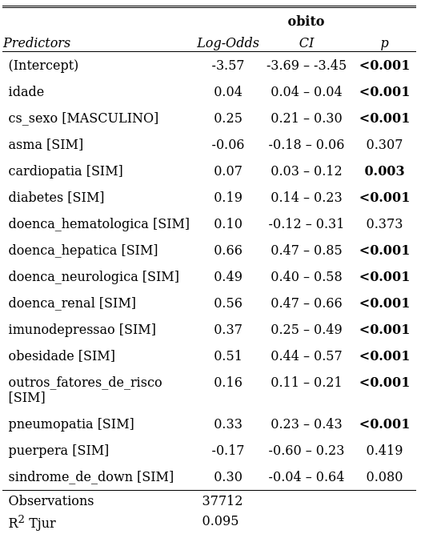
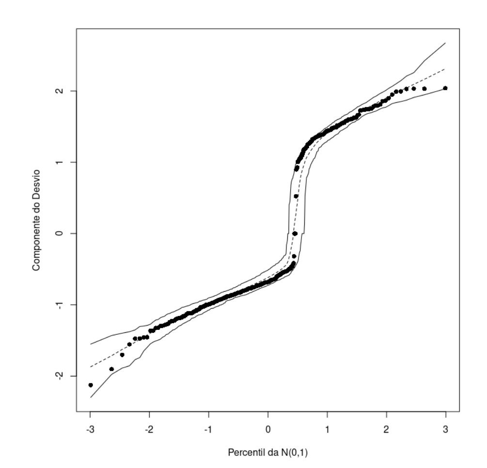
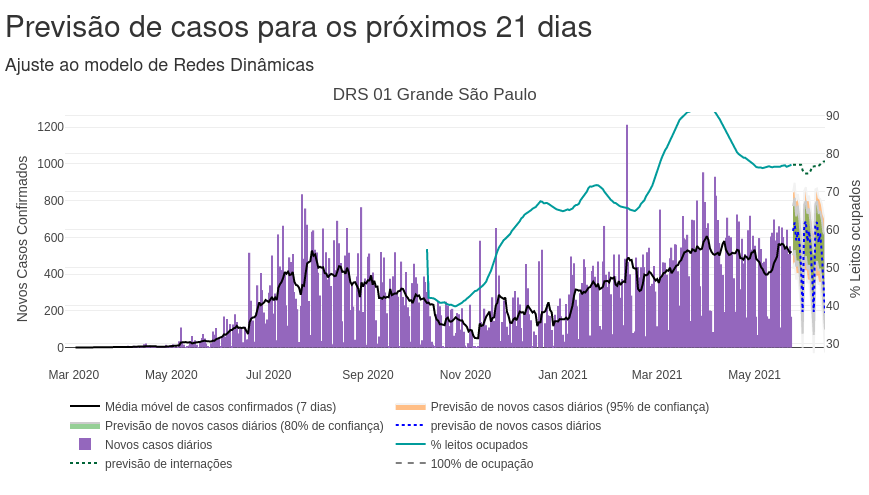

```{r include=FALSE}
#pkg loading
library(tidyverse) # ggplot2, dplyr, etc
library(MASS)
library(ggpubr) # ggbarplot e grafico de pontos
library(RColorBrewer)
library(plotly)
library(GGally)
library(minpack.lm)
library(gather.covid)
```

***

## Fatores de risco do covid-19

Neste trabalho, realizamos um levantamento dos fatores de risco para óbito em decorrência do covid-19 através do modelo de regressão logístico.



***
## Previsão da disponibilidade de leitos hospitalares

Através da previsão de casos utilizando o modelo de Redes Neurais, calculamos a previsão de leitos disponíveis para as Diretorias Regionais de Saúde do Estado de SP.

Disponível em https://predict-icmc.shinyapps.io/covid-19



***

## Text Mining

### Rede de personagens da trilogia O Senhor dos Anéis

Neste trabalho, geramos um dashboard de visualização interativa para nossos dados utilizando o modelo de Reconhecimento de Entidade Mencionada (NER).

Disponível em https://github.com/chicodias/character-network


***
### Previsão do número de casos de Covid-19 através do modelo de Gompertz

Neste projeto, utilizamos o Modelo de Gompertz para prever o "achatamento da curva" de casos confirmados e óbitos decorrentes do Covid-19 no Brasil.

```{r message=FALSE,echo=FALSE}

selectedCity <- read.csv("covid.csv")
fit.Gompertz.cases <- nlsLM(last_available_confirmed ~ SSgompertz(tempo, Asym, b2, b3),
                        data = selectedCity)
  XX = (0:(max(selectedCity$tempo)+10))
  Asym.G<-coef(fit.Gompertz.cases)[1]
  b2.G<-coef(fit.Gompertz.cases)[2]
  b3.G<-coef(fit.Gompertz.cases)[3]
  yp.G<-0
  yp.G<-Asym.G*exp((-b2.G)*(b3.G)^XX)
  predict.G<-data.frame(x=XX,y=yp.G)
  predict.filtra <- predict.G %>% filter(x > max(selectedCity$tempo-1))
  selectedCity.filtra <- selectedCity %>% filter(tempo > max(selectedCity$tempo)-30)
p<-  ggplot(selectedCity.filtra) + 
    geom_line(aes(x = tempo, y = last_available_confirmed), size = 1, color = "blue") +
     geom_point(aes(x=x, y = y, color = "red", alpha = 0.5),
              data = predict.filtra) +
      labs(title = 'Previsão de casos confirmados de COVID-19 em Sâo Paulo', #subtitle=paste(input$cities,"-",input$state), x = 'Dias', 
         y = 'Total de casos confirmados', fill = '') +
    theme_bw()
 ggplotly(p) %>% config(displayModeBar = F) %>% hide_legend()

```


***
### Prevendo o sucesso de filmes através de métodos de Regressão Linear

Trabalho de conclusão do curso de Modelos de Regressão Linear, o qual utilizamos destes para prever o sucesso de alguns filmes com base nas variáveis que tínhamos em nosso conjunto de dados. 


```{r message=FALSE,echo=FALSE}
load("movies.Rdata")
dt <- movies[complete.cases(movies),]%>% dplyr::select(title,audience_score, imdb_rating, genre, critics_score, critics_rating, audience_rating, best_pic_nom, best_pic_win, best_actor_win, best_actress_win, best_dir_win, top200_box,imdb_rating,imdb_num_votes)

nums <- tibble(dt$audience_score,dt$critics_score, dt$imdb_rating, dt$imdb_num_votes)
nums %>% ggpairs()
```

Escolhendo uma das variáveis da amostra como parâmetro para o modelo de classificação

***


```{r message=FALSE, echo = FALSE}
set.seed(123)

nsamples <- floor(0.90*nrow(dt))

train_ind <- sample(seq_len(nrow(dt)), size = nsamples)
train_90 <- dt[train_ind, ]
test_10 <- dt[-train_ind, ]

fit.p3 <- lm(formula = audience_score ~ imdb_rating + genre, data = train_90)

prmovies <- test_10 %>% dplyr::select(title,imdb_rating, genre, critics_score)  


predictions <- predict(fit.p3, prmovies[,-1], interval="prediction", level=0.95)
test <- tibble(title = test_10$title,
               audience_score = test_10$audience_score,
               fit = predictions[,1],
               lower = predictions[,2],
               upper = predictions[,3],
               imdb_rating = test_10$imdb_rating)

test %>% ggplot(aes(x = imdb_rating, y = audience_score)) + geom_point() + geom_smooth(aes(x = imdb_rating, y = audience_score),method=lm, se=TRUE)
```

Comportamento do modelo com a amostra de teste.

  
***